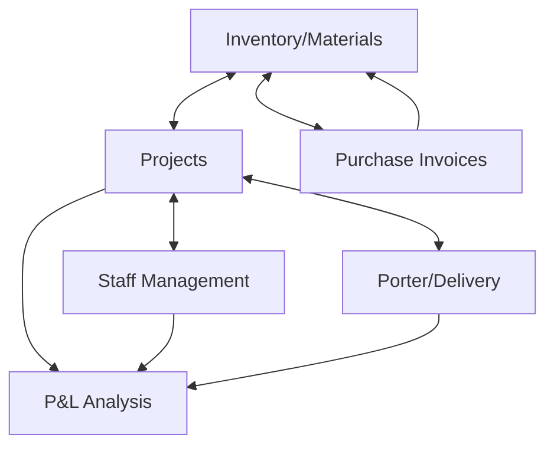

# 🏗️ ENGLABS System Implementation Plan (v1.0.0)

This plan outlines the staged development of the **Inventory & Project Management System** for ENGLABS India Pvt Ltd.

## 🧭 Roadmap Overview

### Phase 1: Core Infrastructure & Project Ledger (Current Focus)
1.  **Database Architecture**: Define Firestore collections for `projects`, `materials`, `staff`, `purchases`, and `deliveries`.
2.  **Project Module (6 & 3)**: Implement the ability to add new projects and link them to inventory.
3.  **Enhanced Staff Management (10)**: Link staff to projects with cost calculations.

### Phase 2: Operations & Logistics
1.  **Daily Requirements (2)**: Project-wise daily material assignment system.
2.  **Porter/Delivery (4)**: Delivery tracking and transport cost module.
3.  **Purchase Integration (7)**: Vendor-linked purchase invoices and auto-stock updates.

### Phase 3: Analytics & Intelligence
1.  **P&L Engine (5)**: Automatic calculation of project-wise profitability.
2.  **Dashboard Visuals (1 & 9)**: Real-time graphs for usage trends, P&L, and stock movement.
3.  **Image Enrichment (8)**: AI-driven image mapping for inventory items.

---

## 🏗️ Technical Architecture (Data Mapping)

## 🧪 TDD-First Strategy
For every module:
1.  **Test**: Create `src/tests/[feature].test.ts` (Vitest).
2.  **Schema**: Create `src/lib/models/[feature].ts`.
3.  **Development**: Implement the UI and Logic.
4.  **Verification**: Confirm tests pass and verify in-app.

## ✅ Module Checklist
- [x] **1. Professional Dashboard**: Real-time stats + Grid Navigator. (COMPLETED)
- [ ] **2. Material Requirement**: Project-wise usage logs. (PENDING)
- [x] **3. Project Management**: Detailed tracking (Staff + Materials). (COMPLETED - Phase 1)
- [ ] **4. Porter Management**: Delivery costs tracking. (PENDING)
- [ ] **5. Profit & Loss**: Auto-calculation engine. (PENDING)
- [x] **6. New Projects**: Dynamic addition interface. (COMPLETED)
- [ ] **7. Purchase Invoices**: Auto-stock refresh from vendors. (PENDING)
- [x] **8. Auto-Images**: Professional image mapping (Phase 1). (COMPLETED)
- [ ] **9. Analytics**: Graphical reports on usage. (PENDING)
- [x] **10. Staff Tracking**: Roster linked to Projects. (COMPLETED)

---
*Authorized by Antigravity OS for ENGLABS India.*
